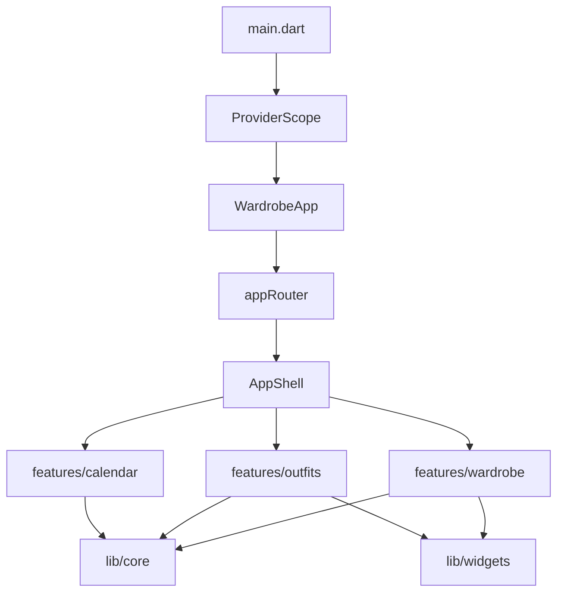

# 代码结构

这份文件记录当前目录，供后续整理对照。产品行为见 [current-state.md](current-state.md)，不能破坏的规则见 [invariants.md](invariants.md)。

依赖方向：`features` 使用 `core` 与 `widgets`。两处例外写在文末「现状落点」。

## 运行时怎么串起来



`main` 创建数据库、图片库和字体，注入 `ProviderScope`。`WardrobeApp` 用当前字体组主题，把路由交给 `GoRouter`。三个功能都挂在侧栏壳里，页面通过 Riverpod 读 Repository 和视觉流水线。

## 仓库

```text
lib/                  Dart 应用
test/                 纯逻辑与迁移测试
assets/models/        本机 ONNX 与 OCR 字典
windows/runner/       Flutter 窗口与 ONNX FFI
windows/third_party/onnxruntime/   ONNX Runtime 头文件和库，不逐文件展开
docs/                 当前状态、不变量、运行与打包
drift_schemas/app_database/        schema 9 起的 Drift 快照
```

`lib/core/database/app_database.g.dart` 由 Drift 生成，手改无效。

## 入口

```text
lib/main.dart
lib/app/
├── app.dart          WardrobeApp
├── providers.dart    databaseProvider、imageStoreProvider
├── router.dart       衣橱、穿搭、日历、设置路由
├── settings_page.dart 外观设置
└── shell.dart        侧栏 AppShell、设置按钮
```

职责：启动本地库，把三个功能接到同一套主题和侧栏。

关键类型：`WardrobeApp`、`appRouter`、`AppShell`、`SettingsPage`。`databaseProvider` 和 `imageStoreProvider` 必须在 `main` 里覆盖，否则抛错。外观种子是 `appAppearanceSeedProvider`。

读写：启动时打开 `%APPDATA%\wardrobe\wardrobe.sqlite` 和 `images\`。路由只负责打开页面。

| 路径 | 页面 |
| --- | --- |
| `/wardrobe` | 衣橱根分类 |
| `/wardrobe/categories` | 衣物分类管理 |
| `/wardrobe/c/:categoryId` | 该分类下的衣物 |
| `/wardrobe/item/new`、`/wardrobe/item/:id`、`/wardrobe/item/:id/edit` | 新增、详情、编辑 |
| `/outfits` | 穿搭根分类 |
| `/outfits/categories` | 穿搭分类管理 |
| `/outfits/c/:categoryId` | 该分类下的穿搭 |
| `/outfits/item/new`、`/outfits/item/:id`、`/outfits/item/:id/edit` | 新增、详情、编辑 |
| `/calendar` | 月历 |
| `/settings` | 字体、文字大小、主体颜色 |

分类管理两条路由都打开 `CategoryManagePage`，用 `CategoryKind.clothing` 或 `CategoryKind.outfit` 区分。

## 数据

```text
lib/core/database/
├── app_database.dart     8 张表、schema 9、种子分类
└── app_database.g.dart   生成代码
```

职责：SQLite 里的结构化数据，以及 schema 1–9 的手写升级。

关键类型：`AppDatabase`。`schemaVersion` 与 `schemaSnapshotBaseline` 都是 9。低于 9 的库走 `_upgradeThroughSchema9`，这段不改写成生成步骤。

读写：`_openConnection` 把库放在 `%APPDATA%\wardrobe\wardrobe.sqlite`。建库时种子衣物分类和穿搭分类。Repository 是唯一写表的入口。

表和功能的对应见下文「表」。

## 路径与图片文件

```text
lib/core/storage/
├── app_paths.dart      APPDATA\wardrobe
├── image_store.dart    正式图与 .tmp
└── image_picker.dart   Windows 选图
```

职责：图片文件的暂存、提交和删除。结构化字段不在这里。

关键类型：`AppPaths`、`ImageStore`、`ImageImport`。

读写：`beginImport` / `beginBytes` 写入 `images\.tmp`。`commit` 挪到 `images\`，`rollback` 删掉这次暂存。`deleteIfOwned` 只删本目录里的文件。衣物和穿搭的 Repository 在同一事务里改表并提交或删除这些文件。

## JSON

```text
lib/core/serialization/
├── measurement_codec.dart            衣物尺寸
├── category_size_fields_codec.dart   分类尺码字段名
├── color_analysis_codec.dart         抠图颜色
├── tag_ocr_codec.dart                吊牌 OCR
└── collage_layout_codec.dart         穿搭拼图摆放
```

职责：表里的文本列和 Dart 对象互相转换。空串、缺字段、坏 JSON 都落成空结果。

关键类型：编码函数成对出现，`encode*` / `decode*`。拼图用 `CollagePlacement`。尺寸字段名 `物件` 读入时改成 `尺寸`。

读写：调用方把结果写进对应列：`measurements`、`sizeFields`、`colorJson`、`ocrJson`、`collageLayout`。空的 `collageLayout` 表示用户删掉了拼图，和「从未保存」不同。

## 分类

```text
lib/core/catalog/
├── catalogs.dart                 CategoryKind、种子、maxCategoryDepth = 2
├── category_tree.dart            父子、深度、同级重名、子树筛选
├── domain/category_policy.dart   系统分类不可删、同级排序
├── category_repository.dart      增删改、上移下移
├── cover_repository.dart         分类封面
├── providers.dart                衣物分类流、穿搭分类流、封面流
├── category_manage_page.dart     分类管理页
└── category_item_dialogs.dart    加子类、选封面、移动分类
```

职责：衣橱和穿搭共用的分类树。大分类下最多两层小分类。同一父级不能重名。系统分类（「无分类」）不能删。删子分类时，衣物或穿搭回到直接上一级。

关键类型：`CategoryKind`、`CategoryRepository`、`CategoryCoverRepository`、`CategoryManagePage`。

读写：`categories`、`category_covers`。封面按 `kind + categoryId` 指向一件衣物或一套穿搭。`clothingCategoriesProvider` 与 `outfitCategoriesProvider` 分开监听同表的两种 `kind`。

## 视觉

```text
lib/core/vision/
├── providers.dart
├── coordinates/
│   ├── image_coordinate_mapper.dart   原图像素、处理图、界面三套坐标
│   └── image_edit_session.dart        一次精修的点选、擦除、填补历史
├── cutout/
│   ├── garment_pipeline.dart          导入、点选、擦除、填补、取色
│   ├── u2net_segmenter.dart           前景分割
│   ├── sam_click.dart                 点选抠外形
│   ├── erase_brush.dart               笔擦
│   ├── fill_patch.dart                取样后涂抹填补
│   ├── color_extract.dart             从 mask 取颜色
│   ├── color_guide.dart               按衣物色板引导 mask
│   ├── image_ops.dart                 缩放、裁切、mask 读写
│   ├── contain_map.dart               BoxFit.contain 点击映射
│   ├── background_blur.dart           保留前景、模糊背景
│   └── shadow_heal.dart               衣架阴影挖补，当前没有调用方
├── ocr/tag_ocr.dart                   吊牌检测与识别
├── model/
│   ├── onnx_session.dart              具名会话与加载状态
│   └── model_status.dart
└── onnx/
    ├── onnx_runtime.dart              Dart FFI
    └── model_assets.dart              把资源模型写到本机 models\
```

职责：衣物照的抠图精修、吊牌 OCR，以及穿搭全身照的背景模糊。推理在本机，经 FFI 进 `windows/runner/garment_onnx.cpp`。

关键类型：`ImageCoordinateMapper`、`ImageEditSession`、`GarmentPipeline`、`TagOcr`、`OnnxSession`、`OnnxRuntime`。Provider：`u2netSegmenterProvider`、`samClickSegmenterProvider`、`tagOcrProvider`、`garmentPipelineProvider`。

读写：模型从 `assets/models/` 落到 `%APPDATA%\wardrobe\models\`。流水线产出原图、抠图 PNG、mask 和 `ColorAnalysis`，由衣物编辑页交给 `ImageStore`。OCR 只建议填写空字段。`shadow_heal.dart` 留在目录里，精修流程不调用它。

## 主题、排序、失败

```text
lib/core/design_system/
├── theme.dart           AppColors、AppPalette、buildAppTheme
├── app_font.dart        字体选项与 font.txt
└── app_appearance.dart  字体、文字大小、主体色
lib/core/sort.dart    列表排序键，仅本次运行
lib/core/failure.dart 图片、模型、推理、存储、校验失败
```

职责：全应用的颜色和字体；衣橱、穿搭列表的排序；视觉和存储抛出的失败类型。

关键类型：`AppAppearance`、`AppPalette`、`AppFontStore`、`ListSort`、`AppFailure`。

读写：外观记在本机 `appearance.json`。没有这份文件时，字体从 `font.txt` 读入。主题的 `fontFamilyFallback` 只有 `Microsoft YaHei`：等线没有「橱」，缺字从这里补。设置项「微软雅黑」也是这个字体名；存过的 `Microsoft YaHei UI` 在 `resolveAppFont` 里改成它。`ClothingSortNotifier` 和 `OutfitSortNotifier` 只活在内存里，重启后回到「添加时间、新的在前」。

## 衣橱

```text
lib/features/wardrobe/
├── wardrobe_page.dart           根分类网格、搜索
├── category_items_page.dart     分类下的衣物
├── category_cascade.dart        分类级联选择
├── item_detail_page.dart        详情、封面、移动分类
├── item_edit_page.dart          新增与编辑，图片阶段和表单阶段
├── item_edit_controller.dart    ItemEditDraft
├── item_photos.dart             图片工作室、吊牌 OCR 块
├── photo_role.dart              garment / tag
├── click_prompt_overlay.dart    点选
├── erase_brush_overlay.dart     笔擦
├── fill_box_overlay.dart        取样与涂抹
├── domain/item_photo_policy.dart
├── data/item_repository.dart
└── providers.dart
```

职责：分类浏览、衣物详情，以及新增时的图片工作室。工作室先点选抠外形、笔擦、取样填补，再从 mask 取色。吊牌照单独加，OCR 建议品牌、面料、尺码。

关键类型：`ItemRepository`、`ItemImageDraft`、`ItemPhotoRole`、`ItemEditDraft`、`ItemPhotoStudio`。

读写：`clothing_items`、`clothing_item_images`，图片文件经 `ImageStore`。`garment` 可作主图和穿搭素材；`tag` 不能当封面，也不能进拼图。列表封面优先用抠图，没有抠图再用原图。

## 穿搭

```text
lib/features/outfits/
├── outfits_page.dart
├── outfit_category_page.dart
├── outfit_detail_page.dart
├── outfit_edit_page.dart              向导壳
├── outfit_collage_board.dart          3:4 拼图板
├── outfit_clothes_picker.dart         从衣橱选衣物
├── presentation/
│   ├── outfit_edit_controller.dart    编辑状态、照片模式
│   ├── outfit_edit_header.dart
│   ├── outfit_photo_step.dart         全身照与拼图
│   ├── outfit_detail_step.dart        名称、季节、备注
│   └── outfit_edit_dialogs.dart
├── domain/
│   ├── outfit_draft.dart
│   ├── outfit_validation.dart
│   ├── outfit_cover_policy.dart       photo / collage 回退
│   ├── outfit_selection_policy.dart
│   └── collage_placement.dart
├── data/outfit_repository.dart
└── providers.dart
```

职责：穿搭向导。一步选衣物和全身照，拼图用衣物的点选抠图；一步写详情。封面可以是全身照或拼图，删掉其中一种后按剩余内容回退。

关键类型：`OutfitRepository`、`OutfitEditController`、`OutfitDraft`、`CollagePlacement`。`OutfitPhotoMode` 是原图、抠图、模糊背景。

读写：`outfits`、`outfit_items`。同一套穿搭里同一件衣物只插入一次。全身照路径在 `imagePath`，原图在 `sourceImagePath`，拼图 JSON 在 `collageLayout`。封面解析在 `outfitCoversProvider`，用衣物抠图和 `outfitUsesCollage`。

## 日历

```text
lib/features/calendar/
├── calendar_page.dart
├── day_plan_panel.dart       当天日程和穿搭
├── virtual_weather.dart      按日期算出的天气，标「虚拟」
├── data/calendar_repository.dart
└── providers.dart
```

职责：月历。点某一天添加日程，同一天可以挂多套穿搭。天气不联网。

关键类型：`CalendarRepository`、`VirtualWeather`。日期键是 `yyyy-MM-dd`。

读写：`day_events`、`day_outfits`。同一套穿搭在同一天只挂一次。

## 共享界面

```text
lib/widgets/
├── common.dart           分类卡、衣物格、搜索、页头、排序按钮
├── piece_collage.dart    拼图画布，并再导出摆放与封面判断
└── zoom_viewport.dart    图片缩放查看
```

职责：衣橱和穿搭列表、详情里重复出现的格子和拼图绘制。

关键类型：`CategoryCard`、`ItemTile`、`LocalCover`、`PageHeader`、`SortButton`。拼图命中检测和自动网格在 `piece_collage.dart`。

读写：不直接写库。封面图从已有路径加载。

## 本机推理

```text
assets/models/
├── u2netp.onnx
├── mobile_sam_encoder.onnx
├── mobile_sam_decoder.onnx
├── ppocr_v4_det.onnx
├── ppocr_v4_rec.onnx
└── ppocr_keys_v1.txt
windows/runner/garment_onnx.cpp    具名会话的加载与运行
```

职责：U²-Net 前景、MobileSAM 点选、PP-OCRv4 吊牌。Dart 侧 `OnnxRuntime` 通过 FFI 调用 `garment_onnx.cpp`，会话按名字放在原生 map 里。

`windows/runner/` 里其余文件是 Flutter 窗口模板。`windows/third_party/onnxruntime/` 是随包的运行时，应用代码不改那里。

## 表

| 表 | 谁写 | 内容 |
| --- | --- | --- |
| `clothing_items` | `LocalItemRepository` | 衣物字段、分类、主图路径 |
| `clothing_item_images` | `LocalItemRepository` | 原图、抠图、mask、颜色 JSON、OCR JSON、角色、是否主图 |
| `categories` | `LocalCategoryRepository` | 衣物与穿搭两套树，`kind` 区分 |
| `category_covers` | `LocalCategoryCoverRepository` | 分类封面指向的衣物或穿搭 |
| `outfits` | `LocalOutfitRepository` | 全身照、封面模式、拼图 JSON |
| `outfit_items` | `LocalOutfitRepository` | 穿搭与衣物，主键是两者一起 |
| `day_events` | `LocalCalendarRepository` | 某天的日程标题 |
| `day_outfits` | `LocalCalendarRepository` | 某天挂的穿搭，主键是日期加穿搭 |

## 测试

整理某一块时，先跑对应文件。

| 测试 | 覆盖 |
| --- | --- |
| `test/db_migration_test.dart` | schema 升级不重复加列、新库为 schema 9 |
| `test/image_lifecycle_test.dart` | 暂存回滚、删除衣物时只删本应用的图 |
| `test/category_tree_test.dart` | 深度、重名、删除后回到上一级、封面范围 |
| `test/sort_test.dart` | 列表排序与封面回退到最新一件 |
| `test/app_font_test.dart` | 未知字体回到等线，`Microsoft YaHei UI` 改成微软雅黑 |
| `test/core/vision/coordinate_test.dart` | 点击进出画面像素 |
| `test/core/vision/cutout_test.dart` | 抠图、填补、取色、contain 映射 |
| `test/core/vision/blur_test.dart` | 背景模糊保留前景 |
| `test/core/vision/ocr_test.dart` | 吊牌文本解析与 CTC |
| `test/outfit_collage_test.dart` | 拼图网格、JSON、命中检测 |
| `test/outfit_cover_policy_test.dart` | 封面从缺失的图回退 |
| `test/outfit_repository_test.dart` | 删全身照或拼图后的封面与布局 |
| `test/outfit_edit_lifecycle_test.dart` | 编辑中放弃或删除时的未提交照片 |
| `test/calendar_test.dart` | 日期键、同一天天气稳定 |
| `test/widget_test.dart` | 穿搭分类种子文案 |

## 现状落点

这些是当前文件所在的位置。

分类管理页和加子类、选封面、移动分类的对话框在 `lib/core/catalog/`。衣橱路由和穿搭路由都直接打开 `CategoryManagePage`。

穿搭编辑已经拆成 `presentation/`、`domain/`、`data/`。衣物编辑的页面在 `lib/features/wardrobe/item_edit_page.dart`，约 1400 行，工作室界面在 `lib/features/wardrobe/item_photos.dart`。点选、笔擦、填补的浮层是同目录下三个 overlay 文件。

列表排序只在本次运行的 `ClothingSortNotifier` 和 `OutfitSortNotifier` 里。

图片文件的生命周期在 `ImageStore`，结构化数据在 Drift。`LocalItemRepository` 和 `LocalOutfitRepository` 同时拿到这两个对象，保存和删除时一起处理。

`lib/core/serialization/collage_layout_codec.dart` 引用 `lib/features/outfits/domain/collage_placement.dart`。`lib/widgets/piece_collage.dart` 引用同一类型，并再导出 `outfit_cover_policy.dart` 里的封面常量。穿搭 Provider 通过 `piece_collage.dart` 使用这些导出。
