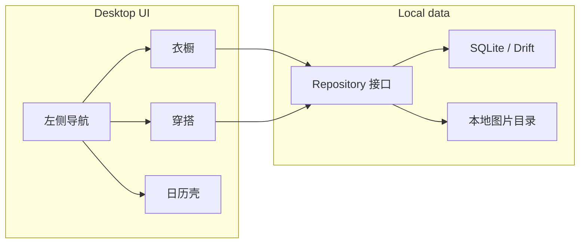

# 电子衣橱（Flutter 桌面先行）

> 归档说明：这是 2026-09-16 确认的第一版计划快照。之后若改方向，请新增 `v2-...md`，不要覆盖本文件。

## 结论

- **技术栈**：Flutter 一套代码。第一期只跑 **Windows 桌面**（不是网页）。以后加 Android/iOS 时复用数据层和业务，**单独做手机布局**。
- **数据**：本地 SQLite + 本地图片文件。仓储层预留同步接口，第一期不接账号/云。
- **设计**：视觉先贴近 [reference/简衣橱](../reference/简衣橱)（白底、蓝紫强调色、圆角卡片），但 **桌面信息架构重做**（左侧导航 + 右侧内容）。更细的美化放到功能可用之后，再用 pen.dev 出桌面/手机高保真稿。
- **第一期范围**：衣橱、穿搭可真正添加/查看/编辑/删除。日历只做月历壳。「我的」不开发，侧栏也不放这个入口。



## 为什么不用「先网页再移植」

你选的是 Windows 上验证、以后出 APP。Flutter Desktop 和以后的手机端是同一工程：

- 现在：`flutter run -d windows`
- 以后：加 `android/`、`ios/`，用 `LayoutBuilder` / 平台判断切到手机布局
- 网页版 Flutter Web 体验一般，不作为第一期目标

pen.dev 仍然有用：它产出的是设计稿，不是 Flutter 代码。建议节奏是 **先做能用的桌面功能 → pen.dev 精修布局 → 再改 Flutter 视觉**。

## 桌面壳（替代底部 Tab）

参考图是手机底栏。桌面改为：

- 左侧窄栏：衣橱 / 穿搭 / 日历
- 右侧主区：当前模块
- 窗口建议最小约 1100x720，默认最大化友好
- 添加衣物/穿搭用 **独立页或宽对话框**（左图右表单），不要照搬手机底部弹层

第一期不做「我的」、VIP、云同步入口、衣橱管理设置页。分类先用内置默认值。

## 衣橱（核心）

首页对齐参考图语义，改成桌面网格：

- 默认分类卡：无分类、内衣、上装、下装、鞋子、包包、配饰
- 卡片封面 = 该分类最新一件图；空则显示 `+` 和 `0个`
- 点分类进入该分类的衣物网格；点空分类或全局 `+` 走添加流程
- 添加入口（桌面）：选本地图片（可多选，但第一期先 **一张一单品**；批量以后再做）
- 搜索框第一期做本地过滤（类别 / 品牌 / 备注），右上筛选按钮可先占位

### 单品字段（按你的文字 + 参考表单）

参考 [简衣橱-添加衣物-2.jpg](../reference/简衣橱/简衣橱-添加衣物-2.jpg)，桌面表单改成两栏，字段如下。括号里的例子 **全部手填**，不做死下拉。

| 字段 | 交互 | 说明 |
|---|---|---|
| 图片 | 本地选图，可换 | 存文件，库里只存路径 |
| 分类 | 选预设分类 | 决定尺码模板，并决定出现在哪个衣橱格子 |
| 类别 | 文本 | 如衬衫、长裤 |
| 款式 | 文本 | 如阔腿裤、直筒裤 |
| 颜色 | 文本 | |
| 季节 | 文本或多选标签 | 春夏秋冬，可空 |
| 面料 | 文本 | |
| 品牌 | 文本 | |
| 价格 | 数字 | |
| 尺码测量 | 随分类切换的一组数字框 | 见下 |
| 购入时间 | 日期 | |
| 购买信息 | 文本 | 商场专柜、淘宝、闲鱼等自己填 |
| 存放位置 | 文本 | |
| 标签 | 逗号/芯片，手输 | |
| 备注 | 多行文本 | |

**分类 → 尺码模板（第一期写死，数据结构可扩展）：**

- 上装 / 内衣：衣长、胸围、肩宽、下摆围
- 下装：裤长、腰围、臀围、大腿围、裤脚围
- 鞋子：鞋码
- 包包 / 配饰 / 无分类：不显示测量项（或只留一个「尺寸」文本）

换分类时只换表单，已填的其它字段保留。

## 穿搭（核心，第一期偏简单）

对齐参考图：无分类、工作、休闲、派对、运动、度假。

第一期穿搭是 **一张效果图 + 元数据**，还不做「从衣橱里挑多件组一套」（那是下一期）。

字段建议：图片、场合分类、名称、季节、备注。增删改查与衣橱同一套交互。

## 日历（只要壳）

对齐 [简衣橱-日历.jpg](../reference/简衣橱/简衣橱-日历.jpg)：

- 月视图、今天、前后月
- 选中日期显示 `yyyy-MM-dd`
- 「点击添加记录」按钮可见，点击提示「后续开放」或空操作
- 农历小字：若接入成本低就做（如 `lunar` 包），否则先省略，不挡主流程

不存穿着记录。

## 数据层（为以后云同步留口）

本地用 **Drift + SQLite**（Windows 稳、以后 Android/iOS 也能用）。图片复制到应用文档目录，例如 `%APPDATA%/wardrobe/images/`。

建议表：

- `categories`（type = clothing | outfit，可后续支持用户自定义）
- `items`（衣物；`measurements` 用 JSON，避免为每种尺码加列）
- `outfits`
- 以后日历再加 `wear_logs`

仓储接口形状（实现只有 Local）：

```dart
abstract class ItemRepository {
  Stream<List<ClothingItem>> watchAll();
  Future<void> upsert(ClothingItem item);
  Future<void> delete(String id);
}
```

每条记录带 `updatedAt`。云同步以后是第二个 Repository 实现，第一期不要写上传逻辑。

## 工程结构（新建于仓库根目录）

仓库现在几乎是空的，只有参考图。计划创建 Flutter 工程（包名暂用 `wardrobe`，应用显示名「衣橱」，你确认计划时可改）：

- [`lib/main.dart`](../lib/main.dart) — 窗口、主题、启动
- [`lib/app/shell.dart`](../lib/app/shell.dart) — 桌面侧栏 + 内容区
- [`lib/core/theme.dart`](../lib/core/theme.dart) — 参考图配色（浅灰底、白卡片、蓝紫 `#5B6CFF` 附近）
- [`lib/core/db/`](../lib/core/db/) — Drift 表与连接
- [`lib/core/storage/`](../lib/core/storage/) — 图片复制/读取
- [`lib/features/wardrobe/`](../lib/features/wardrobe/) — 分类网格、列表、编辑页
- [`lib/features/outfits/`](../lib/features/outfits/)
- [`lib/features/calendar/`](../lib/features/calendar/)
- 状态：Riverpod；路由：go_router

依赖方向：`file_picker`、`path_provider`、`window_manager`、`drift`/`sqlite3`、`uuid`、`intl`。

## 明确不做（第一期）

- 「我的」、会员、意见反馈、分享、使用帮助
- 拍照 / 从相册批量添加（桌面用文件选择即可）
- 穿搭画布（把多件衣物拼成一套）
- 日历写入穿着
- 账号、云同步
- 手机布局
- 按参考图做手机底栏

## 之后怎么用 pen.dev

功能在 Windows 上能走通添加衣物/穿搭之后：

1. 用 pen.dev 画桌面高保真（侧栏、分类卡、编辑页两栏表单）
2. 需要移植手机时再画 390 宽稿
3. 再回头改 Flutter 视觉，而不是一开始就在设计工具里空转

## 实现顺序

1. 初始化 Flutter Windows 工程、主题、侧栏壳
2. 本地库 + 图片存储 + 仓储
3. 衣橱分类网格 → 分类内列表 → 添加/编辑/删除（含尺码模板切换）
4. 穿搭同样三条链路
5. 日历月视图壳
6. 用 Windows 窗口把三条主路径点一遍（无浏览器）

## 第一期待办

- 初始化 Flutter Windows 工程、主题与左侧导航框架
- Drift 本地库 + 图片存储 + Repository 接口（预留后续云同步）
- 衣橱：分类网格、单品列表、随分类变化的尺码表单、增删改
- 穿搭：场合分类网格与图片+元数据增删改
- 日历月视图壳，不写入穿着记录
- 在 Windows 窗口验证衣橱/穿搭主路径与日历界面
